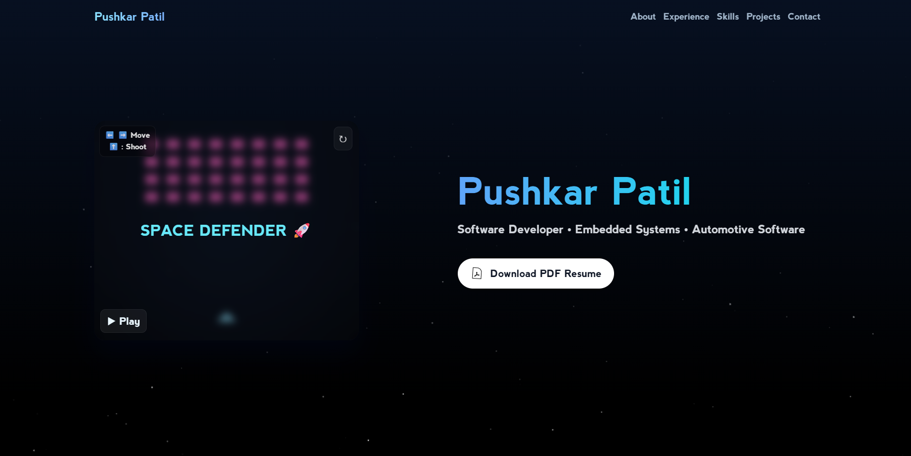

---

# 🚀 Pushkar Patil — Interactive Developer Portfolio

*(An immersive web portfolio built entirely with React, Three.js, TailwindCSS, and creativity.)*

---

## 🌌 Overview

This is my personal **interactive developer portfolio**, designed to showcase my **skills, projects, and experience** — but with a twist.
It’s not just a resume website — it’s an **interactive, animated experience** blending **technology, creativity, and playfulness**.

The project combines smooth animations, 3D visuals, and game-inspired interactions to reflect both the **technical depth** and **creative drive** behind my work.

---

## ✨ Features

### 🎮 Hero Section — *“Space Defender” Mini Game*

* A built-in **Space Invaders–style mini-game** that can be played directly on the home screen.
* **Dynamic reward system**: When you win, the background explodes with shooting stars.
* Includes Play/Pause/Reset buttons, control hints, and an elegant title overlay.

### 🌠 Starry Animated Background

* A **cinematic canvas animation** with twinkling stars and occasional shooting stars.
* Dynamically reacts to game events.
* Entire site floats over this starfield for a clean, futuristic feel.

### 🧠 Skills Section — *3D Neural Constellation*

* Toggle between two views:

  * **Static Structured View** — neatly categorized skills displayed in soft-glass cards.
  * **Interactive 3D Constellation View** — skills orbiting in 3D space, draggable and playful.
* Built with `react-three-fiber` and organized through a unified `skillsData.js` file for easy editing.

### 💼 Experience Section — *Dual View Timeline*

* Toggle between:

  * **Scrollable Timeline View** — an animated vertical experience timeline.
  * **Clean Alternate View** — elegant cards with soft fade-in company banners and contextual color gradients.
* Smooth transitions powered by Framer Motion.

### 🧩 Projects Section — *Dynamic Grid System*

* Populated dynamically from `projectsData.js`.
* Responsive **3-column grid layout** that automatically wraps new projects into rows.
* Auto-handles missing GitHub or Visit links (icons hidden cleanly).

### 🪄 About Me Section

* A clean, glassy card with pastel gradient text and smooth fade-in animations.
* Highlights background, professional focus, and creative side projects.

### 🖤 Global Styling

* Minimalist **pastel-dark theme**.
* Gradients fade seamlessly into the **starry background**.
* Every section feels unified and fluid — no boxy separations.

---

## 🧩 Tech Stack

| Category            | Technologies                              |
| ------------------- | ----------------------------------------- |
| **Frontend**        | React.js, Vite / CRA (depending on setup) |
| **Styling**         | Tailwind CSS, Framer Motion               |
| **3D & Animation**  | Three.js, React Three Fiber, Drei         |
| **Icons**           | React Icons, Lucide Icons                 |
| **Version Control** | Git, GitHub Pages (for deployment)        |

---

**✨ Made with code, curiosity, and constellations.**

---

